# Manual de Usuario — Payment Simulator

Este manual describe paso a paso cómo utilizar el simulador de pagos internacionales, desde la configuración inicial hasta la ejecución de pagos entre bancos.

---

## Tabla de Contenidos

1. [Iniciar la aplicación](#1-iniciar-la-aplicación)
2. [Interfaz general](#2-interfaz-general)
3. [Control del reloj simulado](#3-control-del-reloj-simulado)
4. [Botones de reset](#4-botones-de-reset)
5. [Crear bancos](#5-crear-bancos)
6. [Establecer corresponsalía (Nostro/Vostro)](#6-establecer-corresponsalía-nostrovostro)
7. [Crear clientes](#7-crear-clientes)
8. [Depositar saldo en clientes](#8-depositar-saldo-en-clientes)
9. [Crear y ejecutar pagos](#9-crear-y-ejecutar-pagos)
10. [Horarios de clearing](#10-horarios-de-clearing)
11. [Lectura del historial de pagos](#11-lectura-del-historial-de-pagos)
12. [Ejemplo completo paso a paso](#12-ejemplo-completo-paso-a-paso)

---

## 1. Iniciar la aplicación

```bash
cd simulator-project
npm install
npm run dev
```

Abre el navegador en `http://localhost:10100`.

---

## 2. Interfaz general

La aplicación tiene una barra lateral izquierda con navegación y controles, y un área principal de contenido.

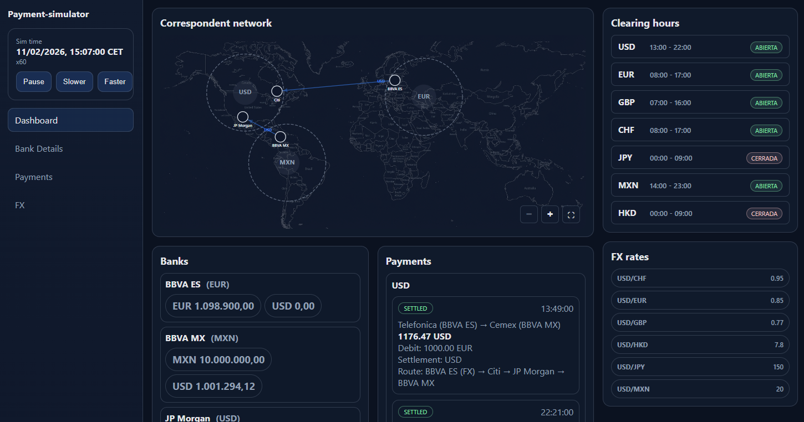

**Páginas disponibles:**

| Página | Descripción |
|--------|-------------|
| Dashboard | Red de corresponsalía, bancos, y resumen de pagos |
| Bank Details | Detalle de cada banco con clientes y saldos |
| Payments | Crear pagos, depositar saldo, y ver historial |
| FX | Tipos de cambio y historial de conversiones |

---

## 3. Control del reloj simulado

El reloj simulado se muestra en la barra lateral superior. Controla el tiempo virtual del sistema, que determina si las cámaras de clearing están abiertas o cerradas.

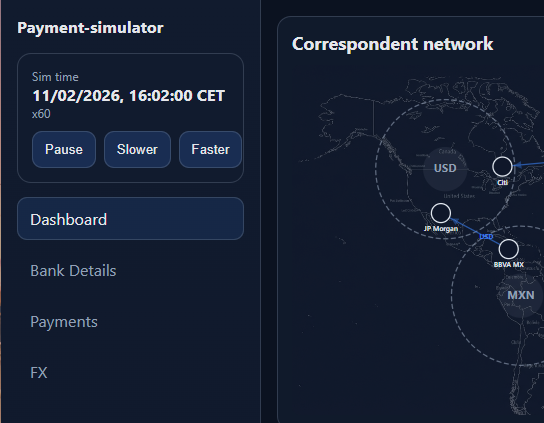

### Controles del reloj

| Botón | Función |
|-------|---------|
| **Play / Pause** | Inicia o detiene el avance del tiempo simulado |
| **Slower** | Reduce la velocidad del reloj (x60 → x30, etc.) |
| **Faster** | Aumenta la velocidad del reloj (x60 → x120 → x240, etc.) |

### Información mostrada

- **Sim time**: Fecha y hora simulada en formato CET (Central European Time)
- **Multiplicador (xN)**: Cuántas veces más rápido avanza el tiempo respecto al tiempo real. Por ejemplo, `x60` significa que 1 segundo real = 1 minuto simulado

### Uso típico

1. Al arrancar, el reloj comienza en **1 de enero 2026, 10:00 CET** a velocidad **x60**
2. Usa **Faster** para avanzar rápido hasta una hora de clearing deseada
3. Usa **Pause** para congelar el tiempo mientras configuras bancos y pagos
4. Usa **Play** para reanudar y que los pagos en cola se procesen

---

## 4. Botones de reset

En la parte inferior de la barra lateral hay tres botones de administración:

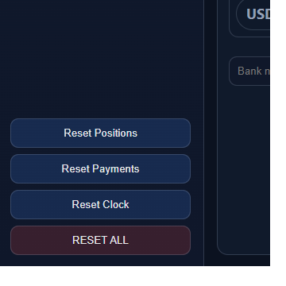

| Botón | Efecto |
|-------|--------|
| **Reset Positions** | Reinicia las posiciones del grafo de red (solo visual) |
| **Reset Payments** | Borra todo el historial de pagos, pero **mantiene** bancos, clientes, saldos, y corresponsalías intactos |
| **Reset Clock** | Reinicia el reloj simulado al punto de inicio (1 enero 2026, 10:00 CET, x60) |
| **RESET ALL** (rojo) | Borra **todos** los datos: bancos, clientes, saldos, pagos, corresponsalías. Reinicia todo desde cero |

> **Nota**: "Reset Payments" es útil cuando quieres limpiar el historial de pagos tras experimentar, sin perder toda la configuración de bancos y clientes.

---

## 5. Crear bancos

Los bancos se crean desde la sección **Banks** del Dashboard.

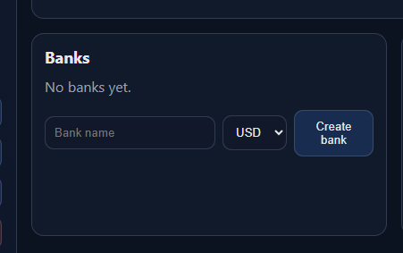

### Pasos

1. Ve a la página **Dashboard**
2. En la sección "Banks", rellena el campo **Bank name** (ej. "BBVA ES")
3. Selecciona la **divisa base** del banco (USD, EUR, GBP, CHF, JPY, MXN, HKD)
4. Pulsa **Create bank**

### Resultado

- Se crea el banco con la divisa base indicada
- Se crea automáticamente una **cuenta HOUSE** (cuenta propia del banco)
- El banco aparece en la lista con su divisa base y saldo actual (inicialmente 0.00)

### Ejemplo de configuración multi-banco

Para un escenario de pagos internacionales EUR→USD, crea al menos:

| Banco | Divisa base | Propósito |
|-------|-------------|-----------|
| BBVA ES | EUR | Banco origen (Europa) |
| Citi | USD | Banco corresponsal (EEUU) |
| JP Morgan | USD | Banco corresponsal (EEUU) |
| BBVA MX | MXN | Banco destino (México) |

---

## 6. Establecer corresponsalía (Nostro/Vostro)

Para que un banco pueda enviar pagos en una divisa extranjera, necesita una **cuenta Nostro** en un banco corresponsal que opere en esa divisa.

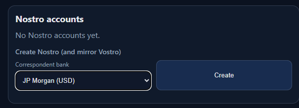

### Pasos

1. Ve a la página **Bank Details**
2. Selecciona el banco propietario (Owner bank) del Nostro
3. Selecciona el banco corresponsal (Correspondent bank) — debe tener una divisa base diferente
4. Pulsa **Create Nostro**

### Resultado

Se crean simultáneamente:
- **Nostro**: Cuenta del banco owner en el banco corresponsal (en la divisa base del corresponsal)
- **Vostro**: Cuenta espejo en el banco owner que refleja la posición del corresponsal

### Ejemplo de cadena de corresponsalía

Para un pago BBVA ES (EUR) → BBVA MX (MXN), necesitas la siguiente cadena:

```
BBVA ES ──Nostro USD──→ Citi
Citi    ──Nostro USD──→ JP Morgan
JP Morgan ──Nostro MXN──→ BBVA MX
```

Esto crea la ruta: `BBVA ES → Citi → JP Morgan → BBVA MX`

> **Importante**: El sistema encuentra automáticamente la ruta más corta entre bancos usando la red de Nostros disponible en la **divisa de liquidación**.

---

## 7. Crear clientes

Los clientes son las entidades que envían y reciben pagos. Cada banco puede tener múltiples clientes.

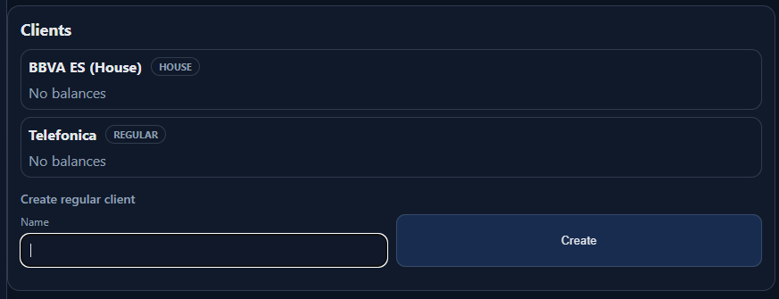

### Pasos

1. Ve a **Bank Details**
2. En la sección del banco deseado, escribe el nombre del cliente
3. Pulsa **Create client**

### Tipos de cliente

| Tipo | Descripción | Se crea... |
|------|-------------|------------|
| **REGULAR** | Cliente normal del banco | Manualmente por el usuario |
| **HOUSE** | Cuenta propia del banco | Automáticamente al crear el banco |
| **VOSTRO** | Cuenta de banco corresponsal | Automáticamente al crear Nostro |

Los clientes REGULAR y HOUSE pueden enviar/recibir pagos y recibir depósitos. Los VOSTRO son gestionados internamente por el sistema.

---

## 8. Depositar saldo en clientes

Antes de poder realizar pagos, los clientes necesitan saldo. Los depósitos se realizan desde la página **Payments**.

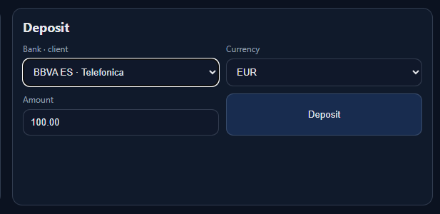

### Pasos

1. Ve a la página **Payments**
2. En la sección **Deposit**, selecciona el cliente (aparece como `NombreBanco · NombreCliente`)
3. Selecciona la **divisa** del depósito
4. Introduce la **cantidad** (ej. 10000.00)
5. Pulsa **Deposit**

### Divisas disponibles para depósito

Solo se pueden depositar divisas que el banco tenga operativas:
- La **divisa base** del banco (siempre disponible)
- Las divisas de sus **cuentas Nostro** (divisas extranjeras que opera)

### Ejemplo

| Cliente | Banco | Divisa | Cantidad | Propósito |
|---------|-------|--------|----------|-----------|
| Empresa A | BBVA ES | EUR | 10000.00 | Origen del pago |
| BBVA ES (House) | BBVA ES | EUR | 50000.00 | Saldo propio del banco |
| BBVA ES (House) | BBVA ES | USD | 5000.00 | Fondo en divisa extranjera |

> **Nota**: Las cuentas HOUSE aparecen en el dropdown como "NombreBanco (House)" y funcionan exactamente igual que un cliente regular para depósitos y pagos.

---

## 9. Crear y ejecutar pagos

### Crear un pago

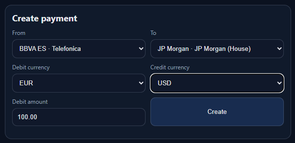

1. Ve a la página **Payments**
2. En la sección **Create payment**, selecciona:
   - **From**: Cliente origen (solo clientes REGULAR y HOUSE con saldo)
   - **To**: Cliente destino
   - **Debit currency**: Divisa que se debita al origen (solo divisas con saldo > 0)
   - **Credit currency**: Divisa que recibe el destino (solo divisas disponibles en el banco destino)
   - **Debit amount**: Cantidad a debitar
3. Pulsa **Create**

### Ciclo de vida del pago

```
QUEUED → SETTLED  (éxito)
QUEUED → FAILED   (error: fondos insuficientes, sin ruta, etc.)
```


### Pagos con conversión FX

Si la divisa de débito ≠ la divisa de liquidación, o la divisa de liquidación ≠ la divisa de crédito, se realizan conversiones automáticas:

- **FX en origen**: Convierte la divisa del cliente a la divisa de liquidación (en el banco origen)
- **FX en destino**: Convierte la divisa de liquidación a la divisa del beneficiario (en el banco destino)

La ruta del pago muestra con la etiqueta `(FX)` en qué banco se realizó la conversión.

### Pagos intrabancarios

Los pagos entre dos clientes del **mismo banco** se procesan **inmediatamente**, sin esperar a que la cámara de clearing esté abierta. Esto incluye:
- Entre dos clientes REGULAR del mismo banco
- Entre un cliente REGULAR y la cuenta HOUSE del mismo banco
- Pagos que involucren una cuenta VOSTRO del mismo banco

---

## 10. Horarios de clearing

Los pagos interbancarios solo se liquidan cuando la cámara de clearing de la **divisa de liquidación** está abierta.

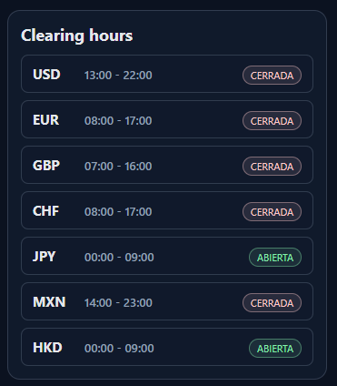

### Horarios por divisa (CET)

| Divisa | Apertura | Cierre | Zona típica |
|--------|----------|--------|-------------|
| USD | 13:00 | 22:00 | América |
| EUR | 08:00 | 17:00 | Europa |
| GBP | 07:00 | 16:00 | Reino Unido |
| CHF | 08:00 | 17:00 | Suiza |
| JPY | 00:00 | 09:00 | Japón |
| HKD | 00:00 | 09:00 | Hong Kong |
| MXN | 14:00 | 23:00 | México |

### Divisa de liquidación

La divisa de liquidación se determina automáticamente:
- Si la divisa de débito está disponible en ambos bancos (origen y destino) → se liquida en divisa de débito
- Si la divisa de crédito está disponible en ambos → se liquida en divisa de crédito
- En otro caso → se busca una divisa común entre las disponibles en ambos bancos

> **Tip**: Para verificar en qué horario se procesará tu pago, observa el campo "Settlement" en el historial de pagos. La cámara de esa divisa debe estar abierta.

### Flujo temporal

1. Se crea el pago → estado **QUEUED**
2. El motor de procesamiento revisa cada 500ms los pagos en cola
3. Si la cámara de la divisa de liquidación está **ABIERTA** (o es un pago intrabancario) → se ejecuta
4. Si está **CERRADA** → permanece en cola hasta que abra
5. Tras ejecución exitosa → estado **SETTLED**

---

## 11. Lectura del historial de pagos

Los pagos se muestran agrupados por divisa de crédito, ordenados del más reciente al más antiguo.

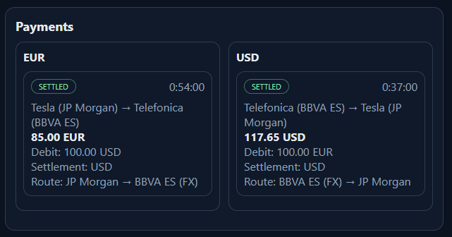

### Campos de cada pago

| Campo | Ejemplo | Descripción |
|-------|---------|-------------|
| **Estado** | SETTLED / QUEUED / FAILED | Estado actual del pago |
| **Hora** | 13:16:00 | Hora de creación (hora local) |
| **Clientes** | Empresa A (BBVA ES) → Empresa B (BBVA MX) | Origen y destino con sus bancos |
| **Importe acreditado** | **1176.47 USD** | Cantidad recibida por el beneficiario |
| **Debit** | 1000.00 EUR | Cantidad debitada al origen |
| **Settlement** | USD | Divisa usada para la liquidación interbancaria |
| **Route** | BBVA ES (FX) → Citi → JP Morgan → BBVA MX | Ruta seguida, con (FX) donde hubo conversión |
| **Error** | Insufficient funds | Razón del fallo (solo si FAILED) |

### Indicador (FX) en la ruta

- `BBVA ES (FX)` → Indica que en BBVA ES se convirtió EUR → USD (divisa de liquidación)
- `BBVA MX (FX)` → Indica que en BBVA MX se convirtió USD → MXN (divisa de crédito)

---

## 12. Ejemplo completo paso a paso

Este ejemplo configura un pago de **1000 EUR** desde un cliente en España hasta un cliente en México, recibiendo **MXN**.

### Paso 1: Crear los bancos

| Banco | Divisa base |
|-------|-------------|
| BBVA ES | EUR |
| Citi | USD |
| JP Morgan | USD |
| BBVA MX | MXN |

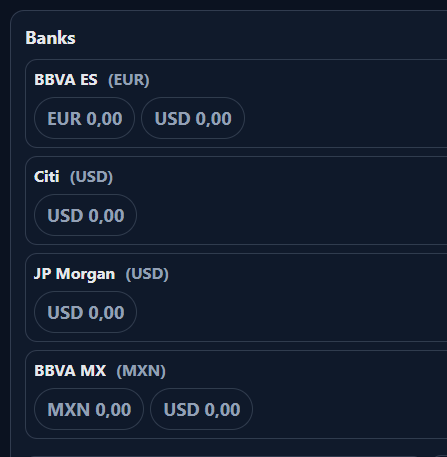

### Paso 2: Establecer corresponsalías

Crea las siguientes cuentas Nostro (en Bank Details):

| Owner | Correspondent | Nostro en divisa |
|-------|---------------|------------------|
| BBVA ES | Citi | USD |
| Citi | JP Morgan | USD |
| JP Morgan | BBVA MX | MXN |

Esto establece la ruta: BBVA ES → Citi → JP Morgan → BBVA MX

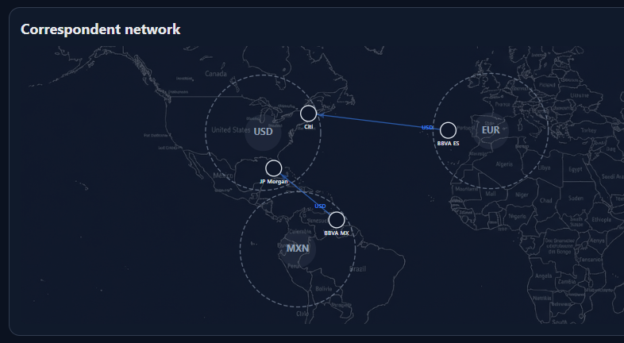

### Paso 3: Crear clientes

- En BBVA ES: crear "Empresa A"
- En BBVA MX: crear "Empresa B"

### Paso 4: Depositar saldo

En la página Payments → Deposit:
- Selecciona "BBVA ES · Empresa A" → EUR → 10000.00 → Deposit

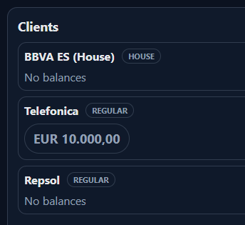

### Paso 5: Ajustar el reloj

Antes de crear el pago, asegúrate de que la cámara de **USD** (divisa de liquidación) esté abierta:
- USD abre de 13:00 a 22:00 CET
- Usa **Faster** para avanzar el reloj hasta las 13:00 o más tarde
- Verifica en el panel de Clearing Hours del Dashboard que USD muestre **ABIERTA**

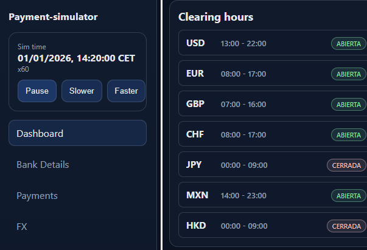

### Paso 6: Crear el pago

En Payments → Create payment:
- From: BBVA ES · Empresa A
- To: BBVA MX · Empresa B
- Debit currency: EUR
- Credit currency: MXN
- Debit amount: 1000.00
- Pulsa **Create**

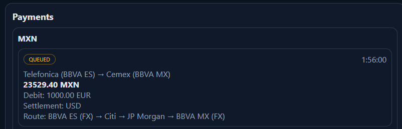

### Paso 7: Verificar resultado

Si la cámara está abierta, el pago se ejecuta en menos de 1 segundo:

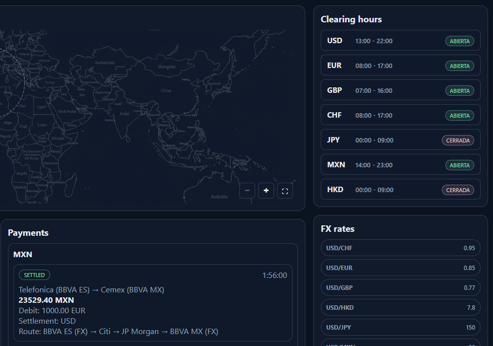

El resultado muestra:
```
SETTLED  13:16:00
Empresa A (BBVA ES) → Empresa B (BBVA MX)
23529.41 MXN
Debit: 1000.00 EUR
Settlement: USD
Route: BBVA ES (FX) → Citi → JP Morgan → BBVA MX (FX)
```

**Interpretación de la ruta:**
1. **BBVA ES (FX)**: Convirtió 1000 EUR → 1176.47 USD (al tipo EUR/USD)
2. **Citi → JP Morgan**: Liquidación interbancaria en USD
3. **BBVA MX (FX)**: Convirtió 1176.47 USD → 23529.41 MXN (al tipo USD/MXN)

---

## Notas adicionales

- Los **tipos de cambio** son fijos y configurados en `server/config.js` con USD como pivote
- El **motor de procesamiento** corre cada 500ms revisando pagos en cola
- Los **saldos** se almacenan con precisión de 2 decimales
- El **historial FX** se puede consultar en la página FX para ver todas las conversiones realizadas
- Usa **Reset Payments** para limpiar el historial sin perder la configuración
- Usa **Pause** en el reloj para configurar todo sin que el tiempo avance
